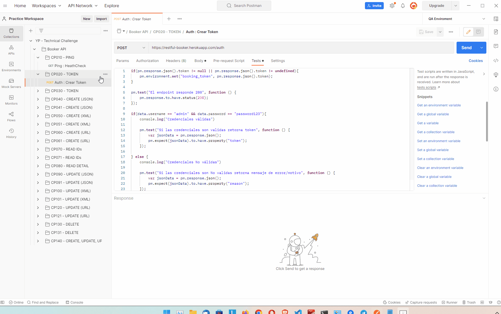
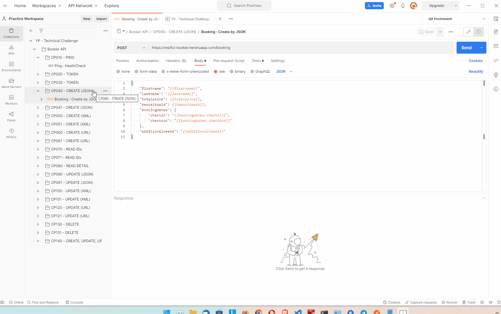

# **YP! TEST BOOKER**

# DESAFÍO

###### Actividades a desarrollar

1. Proponga usted el plan de pruebas a desarrollar para realizar la automatización de pruebas según la funcionalidad indicada en el **Anexo 1.**
2. Implemente el código necesario para la creación del script de pruebas automatizadas según la funcionalidad indicada en el **Anexo 1** e indique la cobertura de pruebas obtenida por el script.
3. Indique las herramientas y técnicas utilizadas para realizar la automatización de la funcionalidad descrita en el **Anexo 1**.

###### Consideraciones:

* Crear una colección en postman que permita realizar pruebas manuales a los servicios web.
* Automatizar las funcionalidades de: *Auth*, *Booking* y *Ping*.
* Considerar en la automatización de pruebas los métodos http: POST, GET, PUT, PATCH, DELETE.
* Considerar la creación de escenarios Happy Paths y UnHappy Paths.
* Considerar en la automatización todas las aserciones posibles.

###### Anexo 1

En la página [https://restful-booker.herokuapp.com/apidoc/index.html](https://restful-booker.herokuapp.com/apidoc/index.html) podrá acceder a la documentación del api de reservas.

# SOLUCIÓN

> ***Nota**: Se sugiere visualizar los archivos **.md** directamente en el repositorio Github o usar un editor local si se descarga el proyecto.*

###### 1. Plan de Pruebas

- El archivo ***[Plan de Pruebas](./TEST_PLAN.md)*** es:[TEST_PLAN.md](./TEST_PLAN.md).
- El archivo ***[Casos de Pruebas](./TEST_CASES.md)*** es:[TEST_CASES.md](./TEST_CASES.md).

###### 2. Código y cobertura

- El código y detalle de los scripts de la automatizacíon se encuentra en [TEST_CASES.postman_collection.json](./TEST_CASES.postman_collection.json) y otros archivos. Para mayor detalle de los archivos ver el ***[Plan de Pruebas](./TEST_PLAN.md) sección 10***.
- La cobertura de las pruebas es:
  - Automatizacíon de la autenticación.
  - Pruebas de escenarios Happy Path y UnHappy Paths de las funcionalidades CRUD del Endpoint.
  - Verificación de códigos de respuesta en cada escenario.
  - Prueba de disponibilidad del sistema y tiempo de respuesta.
  - Escenarios de preubas estabelcidos en el ***[Plan de Pruebas](./TEST_PLAN.md) sección 7.***

###### 3. Herramientas y técnicas

- Para las herramientas utilizadas ver el ***[Plan de Pruebas](./TEST_PLAN.md) sección 4***.
- Para las técnicas utilizadas ver el ***[Plan de Pruebas](./TEST_PLAN.md) sección 6***.

##### **UTILIDADES**

```
::Exportar Jenkins Job
java -jar jenkins-cli.jar -s http://localhost:9090/ -auth username:password get-job "API Booker - Testing" > TEST_CASES.jenkins_job.xml

::Crear/Importar Jenkins Job
java -jar jenkins-cli.jar -s http://localhost:9090/ -auth username:password create-job "API Booker - Testing" < TEST_CASES.jenkins_job.xml
```

##### **DEMO**

###### **Postman Auth**



###### **Postman Create**



###### **Atomatizacion Postman (Archivo BAT)**


###### **Integracion continua con Jenkins**


END
