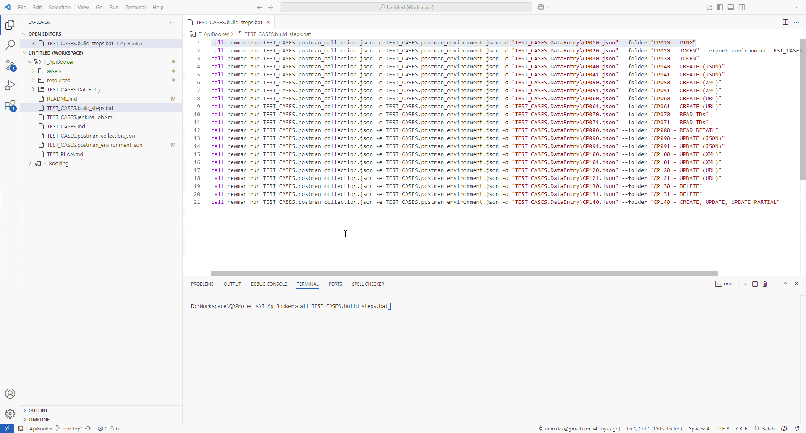

# **TEST API BOOKER**

# OBJETIVO

1. Desarrollar el Plan de Pruebas para la automatización (API de reservas) según la documentación.
   * Booker:[https://restful-booker.herokuapp.com/apidoc/index.html](https://restful-booker.herokuapp.com/apidoc/index.html)
2. Desarrollar los scripts de pruebas automatizadas e indicar la cobertura de pruebas obtenida por el script.
   * Crear una colección en postman que permita realizar pruebas manuales a los servicios web.
   * Automatizar las funcionalidades de:*Auth*,*Booking* y*Ping*.
   * Considerar en la automatización de pruebas los métodos http: POST, GET, PUT, PATCH, DELETE.
   * Considerar la creación de escenarios Happy Paths y UnHappy Paths.
   * Considerar en la automatización todas las aserciones posibles.
3. Especificar las herramientas y técnicas utilizadas.

# SOLUCIÓN

###### 1. Plan de Pruebas


| Documento        | Ruta/Archivo                     |
| ------------------ | ---------------------------------- |
| Plan de Pruebas  | [TEST_PLAN.md](./TEST_PLAN.md)   |
| Casos de Pruebas | [TEST_CASES.md](./TEST_CASES.md) |

###### 2. Código y cobertura

- El código y detalle de los scripts de la automatización se encuentra en [TEST_CASES.postman_collection.json](./TEST_CASES.postman_collection.json) y otros archivos. Para mayor detalle de los archivos ver el ***[Plan de Pruebas](./TEST_PLAN.md) sección 10***.
- La cobertura de las pruebas es:
  - Automatización de la autenticación.
  - Pruebas de escenarios Happy Path y UnHappy Paths de las funcionalidades CRUD del Endpoint.
  - Verificación de códigos de respuesta en cada escenario.
  - Prueba de disponibilidad del sistema y tiempo de respuesta.
  - Escenarios de pruebas establecidos en el ***[Plan de Pruebas](./TEST_PLAN.md) sección 7.***

###### 3. Herramientas y técnicas

- Para las herramientas utilizadas ver el ***[Plan de Pruebas](./TEST_PLAN.md) sección 4***.
- Para las técnicas utilizadas ver el ***[Plan de Pruebas](./TEST_PLAN.md) sección 6***.

##### **UTILIDADES**

```
::Exportar Jenkins Job
java -jar resources/jenkins-cli.jar -s http://localhost:9090/ -auth your_user:your_password get-job "API Booker - Testing" > TEST_CASES.jenkins_job.xml

::Crear/Importar Jenkins Job
java -jar resources/jenkins-cli.jar -s http://localhost:9090/ -auth your_user:your_password create-job "API Booker - Testing" < TEST_CASES.jenkins_job.xml
```

## **DEMO**

###### **Postman [Auth]**


###### **Postman [Create]**


###### **Automatización Postman (Archivo BAT)**



###### **Integración continua (Jenkins)**


END
